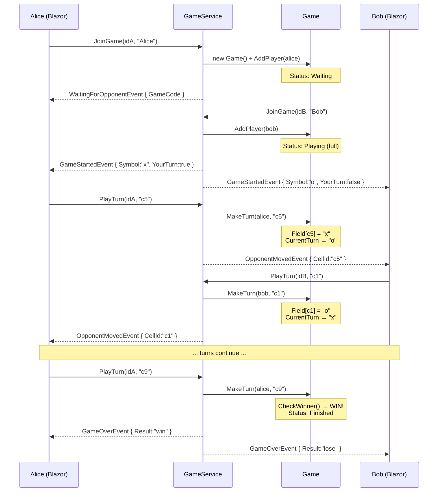
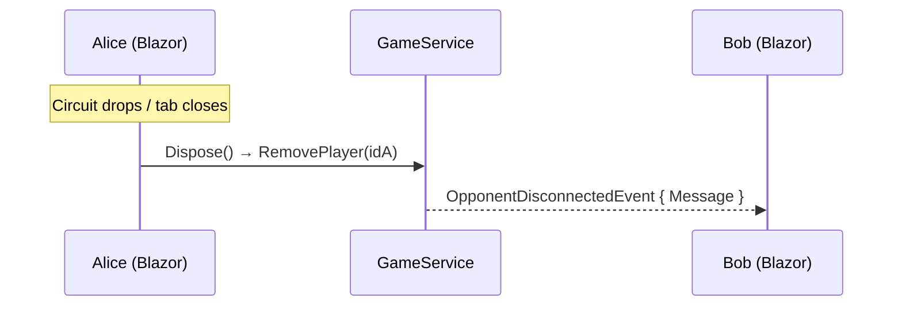
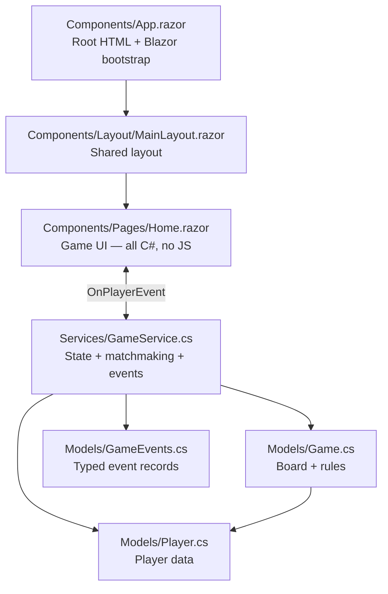

# Architecture Walkthrough

## Layers

```
Program.cs                          → wiring (DI, middleware, Blazor route)
Models/                             → data + rules (Game, Player, TurnResult, GameEvents)
Services/                           → orchestration (matchmaking, state, events)
Components/App.razor                → root HTML document
Components/Layout/MainLayout.razor  → shared layout (container + heading)
Components/Pages/Home.razor         → game UI (name entry, board, status — all C#)
wwwroot/app.css                     → global styles
```

---

## 1. Entry Point — `Program.cs`

Three things are wired:

- **Razor Components + Interactive Server** — Blazor Server mode (uses SignalR under the hood for real-time UI)
- **`GameService`** — registered as a **singleton** (one shared instance, all state in memory)
- **`MapRazorComponents<App>()`** — serves the Blazor app with server-side interactivity

`UseStaticFiles()` serves `wwwroot/app.css`. `UseAntiforgery()` is required by Blazor.

---

## 2. Models — the data

### `Player.cs`

| Property | Type | Purpose |
|----------|------|---------|
| `ConnectionId` | `string` | Unique player ID (a GUID generated per Blazor component instance) |
| `Name` | `string` | Display name entered by the user |
| `Symbol` | `string?` | `"x"` or `"o"`, assigned on game join |
| `Game` | `Game?` | Back-reference to the game they're in |

### `Game.cs`

| Property | Type | Purpose |
|----------|------|---------|
| `Code` | `string` | Random 4-letter code (e.g. `"XKWM"`) |
| `Field` | `Dictionary<string, string?>` | Board: `c1`–`c9`, each `null` / `"x"` / `"o"` |
| `Players` | `List<Player>` | 0–2 players |
| `CurrentTurn` | `string` | `"x"` or `"o"`, starts as `"x"` |
| `Status` | `GameStatus` | `Waiting` → `Playing` → `Finished` |
| `Winner` | `string?` | Winning symbol or `"draw"` |
| `WinningCells` | `string[]?` | The 3 cells that won |

**Key methods:**

- **`AddPlayer()`** — assigns symbol (`x` to first, `o` to second), flips status to `Playing` when 2 players joined
- **`MakeTurn()`** — validates: game active? your turn? cell exists? cell empty? Then places mark, checks winner, switches turn
- **`CheckWinner()`** — loops 8 winning lines; if 3 match → win; if all 9 filled → draw

### `TurnResult` (record)

Factory methods: `Ok()`, `Fail(error)`, `Win(symbol, cells)`, `Draw()` — clean way to return multiple outcomes from one method.

### `GameEvents.cs`

Typed event records for inter-player communication. Each event is a C# record inheriting from `GameEvent`:

| Event | Payload | When |
|-------|---------|------|
| `WaitingForOpponentEvent` | `GameCode` | First player matched, waiting |
| `GameStartedEvent` | `OpponentName, Symbol, YourTurn, GameCode` | Two players matched |
| `OpponentMovedEvent` | `CellId` | Opponent made a valid move |
| `GameOverEvent` | `Result, Message, WinningCells?` | Win / lose / draw |
| `OpponentDisconnectedEvent` | `Message` | Other player left |
| `ServerFullEvent` | `Message` | Max games reached |
| `TurnErrorEvent` | `Error` | Invalid move rejected |

---

## 3. Service — `GameService.cs`

Orchestration layer between Blazor components and models. Owns all state.

| Field | Purpose |
|-------|---------|
| `_players` | `Dictionary<playerId, Player>` |
| `_games` | `List<Game>` |
| `_lock` | All operations are `lock`-ed (Blazor Server is multi-threaded) |
| `OnPlayerEvent` | `event Action<string, GameEvent>` — fires typed events to subscribers |

### Methods

**`JoinGame(playerId, name)`** — FIFO matchmaking:
1. Create a `Player`
2. Find any game with `Status == Waiting`
3. If none, create a new `Game` (unless `MaxConcurrentGames` reached)
4. Add player to game
5. Fire `WaitingForOpponentEvent` or `GameStartedEvent` (to both players)

**`PlayTurn(playerId, cellId)`** — look up player, delegate to `Game.MakeTurn()`, fire `OpponentMovedEvent` + `GameOverEvent` or `TurnErrorEvent`

**`RemovePlayer(playerId)`** — remove from game, clean up empty games, fire `OpponentDisconnectedEvent` to opponent

### Event-driven pattern

Instead of returning data to a hub, the service fires `OnPlayerEvent(playerId, event)`. Each Blazor component subscribes in `OnInitialized()` and filters by its own `playerId`. Events are dispatched via `InvokeAsync()` + `StateHasChanged()` to safely update the UI across threads.

---

## 4. Blazor Components

### `App.razor` — Root document

The HTML shell (`<html>`, `<head>`, `<body>`). Loads:
- `app.css` (global styles)
- `TicTacToe.styles.css` (auto-generated CSS isolation bundle)
- `blazor.web.js` (Blazor framework — manages the SignalR circuit)

Sets `@rendermode="InteractiveServer"` on both `<HeadOutlet>` and `<Routes>`.

### `MainLayout.razor` — Layout wrapper

Renders the `.container` div and `<h1>` heading, then `@Body` for page content.

### `Home.razor` — Game page (`@page "/"`)

All game logic in C# — no JavaScript. Manages two screens:

**Name Entry screen:**
- Text input bound to `playerName`
- "Play" button calls `JoinGame()`

**Game screen:**
- Status message (`statusMessage`)
- 3×3 board rendered with a `@for` loop — each cell is a `<button>` with conditional CSS classes
- Game code display
- "Leave" button calls `LeaveGame()`

**Key lifecycle:**
- `OnInitialized()` — subscribes to `GameService.OnPlayerEvent`
- `Dispose()` — unsubscribes + calls `RemovePlayer()` (cleanup on circuit disconnect)
- `HandleGameEvent()` — pattern-matches on event type, updates local state, calls `StateHasChanged()`

### `Home.razor.css` — Scoped styles

CSS isolation — styles are automatically scoped to `Home.razor` at build time. Contains board, cell, button, and animation styles (identical visual design to the original).

---

## 5. Complete Game Flow



### Disconnect Flow



---

## Layer Responsibilities


