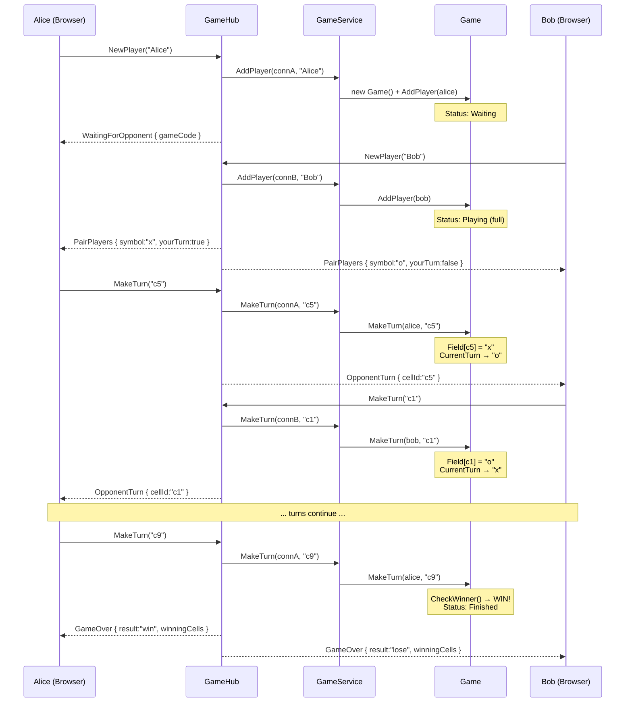
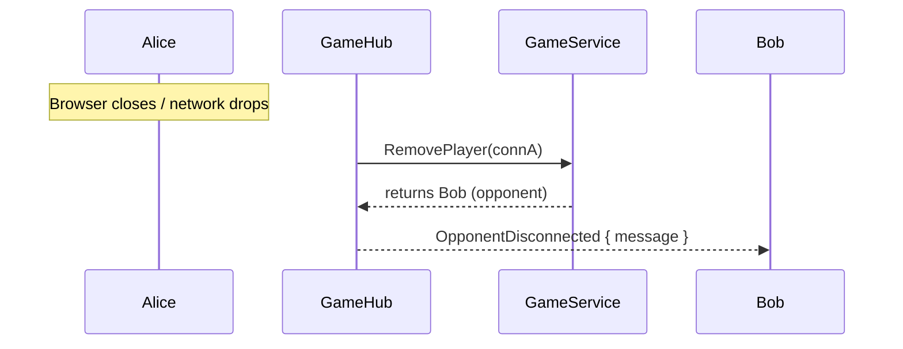
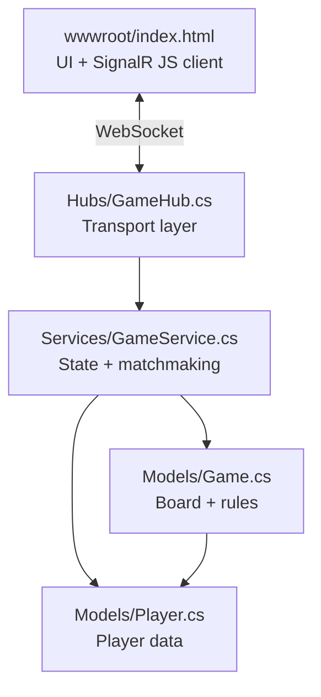

# Architecture Walkthrough

## Layers

```
Program.cs          → wiring (DI, middleware, hub route)
Models/             → data + rules (Game, Player, TurnResult)
Services/           → orchestration (matchmaking, state, thread safety)
Hubs/               → real-time transport (SignalR ↔ browser)
wwwroot/index.html  → client (vanilla HTML/JS)
```

---

## 1. Entry Point — `Program.cs`

Three things are wired:

- **SignalR** — real-time WebSocket communication
- **`GameService`** — registered as a **singleton** (one shared instance, all state in memory)
- **Hub route** — `/gamehub` is the WebSocket endpoint clients connect to

`UseDefaultFiles()` + `UseStaticFiles()` serve `wwwroot/index.html` as the client.

---

## 2. Models — the data

### `Player.cs`

| Property | Type | Purpose |
|----------|------|---------|
| `ConnectionId` | `string` | SignalR's unique WebSocket ID (like Socket.IO's `socket.id`) |
| `Name` | `string` | Display name entered by the user |
| `Symbol` | `string?` | `"x"` or `"o"`, assigned on game join |
| `Game` | `Game?` | Back-reference to the game they're in |

### `Game.cs`

| Property | Type | Purpose |
|----------|------|---------|
| `Code` | `string` | Random 4-letter code (e.g. `"XKWM"`) |
| `Field` | `Dictionary<string, string?>` | Board: `c1`–`c9`, each `null` / `"x"` / `"o"` |
| `Players` | `List<Player>` | 0–2 players |
| `CurrentTurn` | `string` | `"x"` or `"o"`, starts as `"x"` |
| `Status` | `GameStatus` | `Waiting` → `Playing` → `Finished` |
| `Winner` | `string?` | Winning symbol or `"draw"` |
| `WinningCells` | `string[]?` | The 3 cells that won |

**Key methods:**

- **`AddPlayer()`** — assigns symbol (`x` to first, `o` to second), flips status to `Playing` when 2 players joined
- **`MakeTurn()`** — validates: game active? your turn? cell exists? cell empty? Then places mark, checks winner, switches turn
- **`CheckWinner()`** — loops 8 winning lines; if 3 match → win; if all 9 filled → draw

### `TurnResult` (record)

Factory methods: `Ok()`, `Fail(error)`, `Win(symbol, cells)`, `Draw()` — clean way to return multiple outcomes from one method.

---

## 3. Service — `GameService.cs`

Orchestration layer between the hub and models. Owns all state.

| Field | Purpose |
|-------|---------|
| `_players` | `Dictionary<ConnectionId, Player>` |
| `_games` | `List<Game>` |
| `_lock` | All operations are `lock`-ed (SignalR is multi-threaded) |

### Methods

**`AddPlayer(connectionId, name)`** — FIFO matchmaking:
1. Create a `Player`
2. Find any game with `Status == Waiting`
3. If none, create a new `Game` (unless `MaxConcurrentGames` reached)
4. Add player to game
5. Return whether game started (2 players now)

**`MakeTurn(connectionId, cellId)`** — look up player, delegate to `Game.MakeTurn()`, return result + opponent

**`RemovePlayer(connectionId)`** — remove from game, clean up empty games, return opponent for notification

---

## 4. Hub — `GameHub.cs`

Translates WebSocket messages ↔ service calls. Uses primary constructor DI.

### Client → Server

| Method | Trigger | Action |
|--------|---------|--------|
| `NewPlayer(name)` | Client clicks "Play" | Matchmake → send `WaitingForOpponent` or `PairPlayers` |
| `MakeTurn(cellId)` | Client clicks a cell | Validate → relay `OpponentTurn` or `GameOver` |

### Server → Client

| Event | Payload | When |
|-------|---------|------|
| `WaitingForOpponent` | `{ gameCode }` | First player matched, waiting |
| `PairPlayers` | `{ opponent, symbol, gameCode, yourTurn }` | Two players matched |
| `OpponentTurn` | `{ cellId }` | Opponent made a valid move |
| `GameOver` | `{ result, message, winningCells }` | Win / lose / draw |
| `OpponentDisconnected` | `{ message }` | Other player left |
| `ServerFull` | `{ message }` | Max games reached |
| `TurnError` | `{ error }` | Invalid move rejected |

### `OnDisconnectedAsync()`

Automatic SignalR override — fires on WebSocket drop. Cleans up player, notifies opponent.

---

## 5. Complete Game Flow



### Disconnect Flow



---

## Layer Responsibilities


